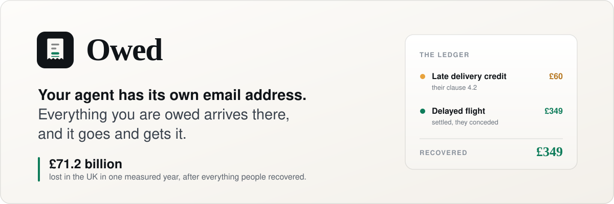
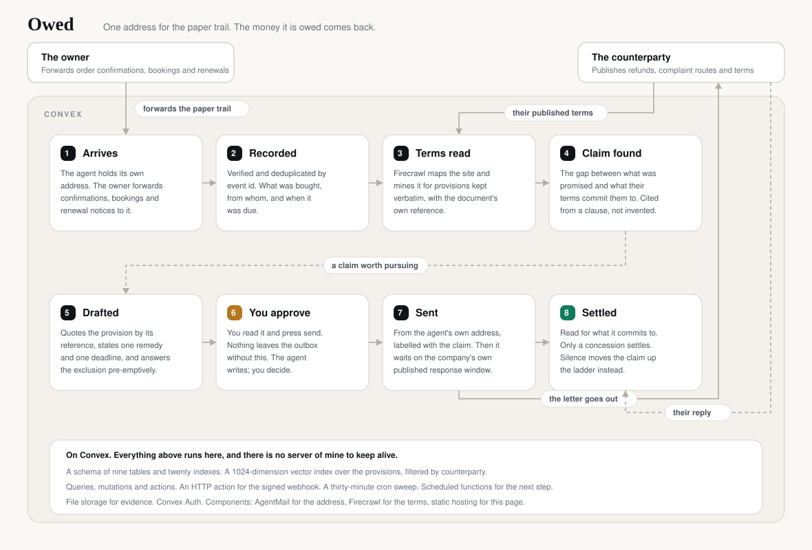

<!--
  The claim links below use stable slugs (demo-found, demo-polite, demo-silent,
  demo-gate) rather than row ids. A Convex id belongs to whoever created the row,
  so a link built from one is dead for every other visitor, which is every judge.
  A slug resolves against the caller's own seeded copy instead, which is the
  reason the worked example is seeded on arrival rather than only on request.
-->

<p align="center"></p>

<p align="center"><strong>Your agent holds the paper trail, so it finds what you are owed instead of waiting to be told.</strong></p>

<p align="center"><a href="https://fantastic-hamster-482.convex.site">Open the ledger</a> · <a href="https://fantastic-hamster-482.convex.site#claim=demo-found">Read a claim it found</a> · <a href="https://fantastic-hamster-482.convex.site#claim=demo-polite">See an apology settle nothing</a></p>

Owed holds the paper trail, so it notices a claim instead of waiting to be told about one.

You forward what already lands in your inbox anyway: order confirmations, bookings, renewal notices. Owed reads the company's own published terms, works out what you are owed, writes the letter that cites the clause by its reference, and asks you before it sends anything.

That is the difference that matters. Nobody has to remember that a lens arrived cracked six weeks ago, or that a hotel took a deposit it said it would return. The agent is holding the receipt, so the claim finds you rather than the other way round.

I am the user. My paper trail is the usual mess: a lens, two hotel bookings, three subscriptions I meant to cancel, train tickets. The refunds I never chased are the ones too small to be worth an evening and too annoying to let go. Owed is for the person who is not going to spend that evening, and should not have to.

Built with **Convex**, **AgentMail**, **Firecrawl** and **OpenAI**, for the **Convex All Gas Hackathon**.

## A minute inside the product

Press **Continue as a guest** on the live URL and the ledger arrives already holding four cases, because a judge should not have to forward an email and wait to find out what this does. Every row is labelled as the worked example, its counterparty is a fictional business on a `.example` domain that cannot resolve, and nothing in it was generated by a model call at runtime. Once you are in, the links below open straight into one of the four.

| Try this | Watch what happens |
|---|---|
| [The claim it found](https://fantastic-hamster-482.convex.site#claim=demo-found) | A forwarded confirmation became a record, the retailer's own returns page was read, and a clause promising a full refund on damaged goods was quoted back by its reference. Nobody described a dispute, and it settled: the money at the top of the ledger is what came back in writing. |
| [The polite nothing](https://fantastic-hamster-482.convex.site#claim=demo-polite) | An apology arrives with no decision behind it. It is read as an acknowledgement, not a concession, so the claim stays open. The agent does not declare victory on a kind sentence. |
| [The silence that escalated](https://fantastic-hamster-482.convex.site#claim=demo-silent) | No reply inside the window the company itself publishes. The sweep moves the claim up a rung and drafts a different letter. Silence is not agreement, and the ledger says so. |
| [The letter waiting on you](https://fantastic-hamster-482.convex.site#claim=demo-gate) | A drafted letter that cites clause 11.3 and answers the clause 11.4 exclusion before they raise it. Nothing leaves the outbox until you press send, and on the example pressing it writes to the timeline that nothing was transmitted rather than emailing anyone. |

## £71.2 billion a year is not recovered

That is the UK government's own figure. The Department for Business and Trade published the **Consumer Detriment Survey 2024** on 27 March 2025: **£71.2 billion of net consumer detriment** in the twelve months to April and May 2024. Net means after everything people did manage to get back. It is what was lost and stayed lost.

Behind it, in the same survey:

- **38.5 million UK consumers affected, 72% of UK adults**, across 294.9 million problems.
- **22% of those problems saw no action taken at all**, roughly 65 million of them. Not a complaint that failed, no complaint.
- **In 15% of cases where a refund was requested, no refund was given at all.**
- **In 25% of incidents the seller did nothing at all**, setting aside those where an apology or an explanation was the whole of the response.
- **47% of 18 to 29 year olds who experienced detriment** did not act on at least one incident, the highest of any age group.

The barrier is not that people do not know they were wronged. It is that pursuing it costs an evening, and the amount is usually £40. Owed moves that evening onto something that already has the paperwork and does not get bored.

## How it works



**Your agent has an address.** A real account gets an inbox of its own, created on first use. A guest gets an alias on the shared inbox, so it costs no allowance and mail sent to it still lands in that guest's ledger and nowhere else. Either way, mail arriving is verified and deduplicated by event id, then routed to the claim it belongs to. The plan allows three inboxes, which is why guests are routed through aliases rather than handed one each: provisioning one per visitor spent the allowance within the first few people to open the deployed app, and whoever arrived after the last slot got an error where an address should be. One of the three is the shared inbox the aliases sit on, so two accounts can hold an inbox of their own; past that the app returns a sentence explaining why rather than an error trace, and the guest button still shows the whole product. The agent never asks for a password to your real mailbox and never reads your life. It reads what you forward.

**The paper trail comes first.** Order confirmations, bookings, delivery promises and renewal notices become records: what was bought, from whom, and when it was due. Everything downstream is built on that, which is what lets Owed find a claim instead of waiting for one.

**Claims are argued from the company's own words.** Firecrawl maps their site, picks out the terms, and mines them for provisions kept verbatim with the document's own reference number. Each one is embedded and stored in a filtered vector index, so a claim retrieves the clauses that bear on it. The letter cites the provision by reference and answers the exclusion they would rely on before they raise it.

**Nothing is sent without you.** The agent drafts. You read the letter and press send. One person, one dispute, one thread: there is no bulk mail here and no sending without approval.

**Only a concession settles anything.** A reply is read for what it commits to. An apology with no decision behind it is an acknowledgement. A request for more time is a stall. Neither settles a claim, and neither closes it. Silence moves the claim up the ladder on a schedule, and after the last rung the next step is yours, which the product says out loud rather than quietly giving up.

## What it costs to run

No OpenAI credits came with the event, so spend is real money and I treated it that way.

- Every model call goes through one module and is cached by a content hash of its exact inputs. A repeated input costs nothing.
- `gpt-4o-mini` and `text-embedding-3-small`, nothing larger.
- No model call ever runs on a page load.
- The ledger footer reports this deployment's distinct calls, tokens and dollar spend, read out of the cache table rather than estimated.

<details>
<summary><strong>The Convex surface</strong></summary>

| Area | What is used |
|---|---|
| Schema | Nine tables, nineteen indexes and a vector index, with typed validators for the claim lifecycle and the reply classifications |
| Vector search | A 1024-dimension index over the provisions, filtered by counterparty, retrieved from an action |
| Functions | Queries, mutations and actions, with internal functions for everything the UI must not reach |
| HTTP | An HTTP action for the AgentMail webhook, mounted in `convex/http.ts` |
| Scheduling | A thirty-minute cron sweep, plus scheduled functions for each next step and for drafting |
| Auth | Convex Auth, with a password provider and an anonymous one so the deployed app is usable in one click |
| Components | `@agentmail/convex` for the address, `@firecrawl/firecrawl-convex` for the terms, `@convex-dev/static-hosting` for this page |
| Storage | File storage for evidence attached to a claim |

Two rules the code enforces rather than describes. The sweep never sends, only drafts. And a claim is only ever settled by a `concession`, so the number at the top of the ledger is money that actually came back.

</details>

## The failures that changed the code

- **The first architecture had a circular import and TypeScript hid it.** `ai.ts` logged model calls onto a claim, claims scheduled a letter, and letters called the model. The cycle made the inferred type of every public query `any`, which meant the front end was silently untyped. I moved approval into `letters.ts`, where the letter lifecycle lives, and the cycle went. `tsc` had been passing the whole time it was broken.
- **I called `readCache` with `runQuery` and it was declared an action.** It had never run. Reading the component type definitions rather than trusting my notes caught it, along with `map` being called with an object where the real signature is positional.
- **`ctx.vectorSearch` is not available in a query context.** I found this by running it rather than assuming it, which is why provision retrieval lives in an action.
- **The architecture diagram was invalid XML and rendered as an error page.** XML comments cannot contain a run of hyphens, and I had used dashes as separators. I only found it by rendering the file and looking at it.

## Honest limits

The terms reader covers refunds, returns, cancellations, warranties, complaints, delivery and compensation pages. A company that publishes its obligations only inside a PDF, or behind a login, will not be read. The detector is strict on purpose: a claim only exists when a specific provision commits them to a specific remedy and the record shows the condition was met, so it will miss real entitlements that no clause names.

The reply classifier is the weakest link. It is a single model call with a fixed set of labels, and a reply that concedes nothing but reads as though it might could be filed as an acknowledgement when it deserved a rung. The ladder stops after three letters by design, and says so in the product.

The £71.2 billion figure is the government's, for the UK, and measures detriment rather than anything Owed recovers. I make no claim about how much of it this product would return.

## Run it

```bash
npm install
npx convex dev
```

Then set the three keys on the deployment:

```bash
npx convex env set OPENAI_API_KEY <key>
npx convex env set AGENTMAIL_API_KEY <key>
npx convex env set AGENTMAIL_WEBHOOK_SECRET <whsec_...>
npx convex env set FIRECRAWL_API_KEY <fc-...>
npx @convex-dev/auth
```

`npx @convex-dev/auth` writes the JWT signing keys Convex Auth needs. Without it, sign-in fails with a jose import error rather than anything useful, so the app now says so on screen instead.

The front end is served from the deployment itself by static hosting:

```bash
npm run deploy
```

## Disclosure and licence

The worked example is reconstructed content, not a live mailbox. It is seeded into a guest's ledger on arrival, and a real account can load it on request from the empty state. It is labelled in the UI, and its counterparties are fictional businesses on `.example` domains, which RFC 2606 reserves so that they can never resolve. It loads only onto an empty ledger, so it can never sit beside a claim the owner did not create, and the totals block says when the figures above it cover it. No mail was sent to create it and no model was called: it exists so a judge can see the product work without forwarding an email and waiting. Pressing send on the example advances the claim and writes to its timeline that nothing was transmitted. Publishing a claim asserting that a real named business stonewalled me would be a false statement about a real company, and a product whose argument is that nothing gets overclaimed cannot open by overclaiming.

Real claims run on real forwarded mail with the personal details removed. The survey figures are the UK government's own and are cited above. The banner and the diagram are hand-authored SVG in `docs/`.

Built by [Robert Moore](https://github.com/iamrobertmoore). **MIT**. See [LICENSE](LICENSE).
